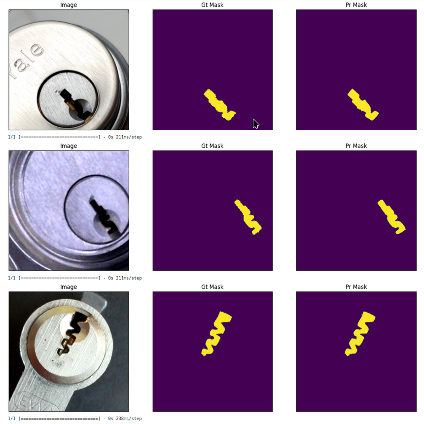
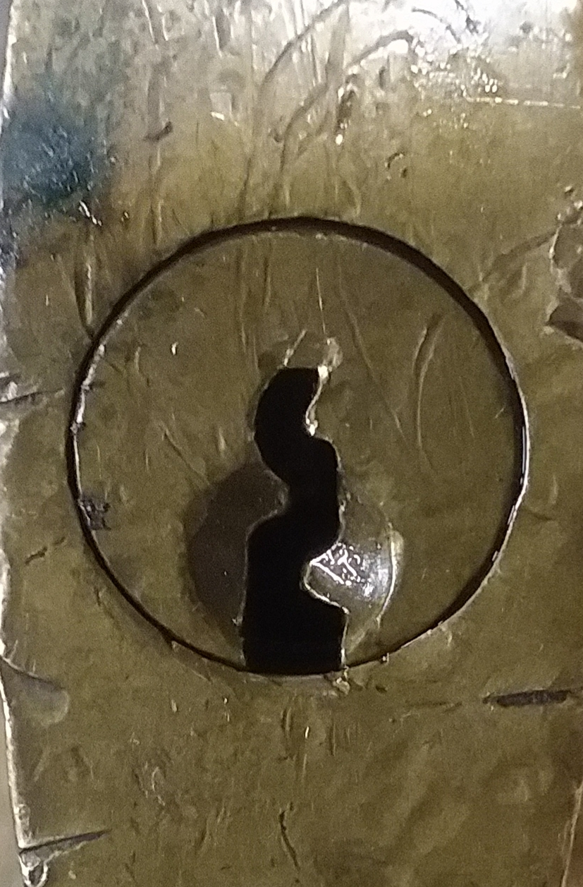
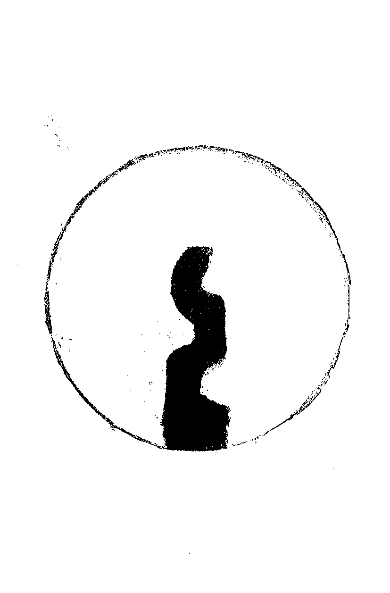
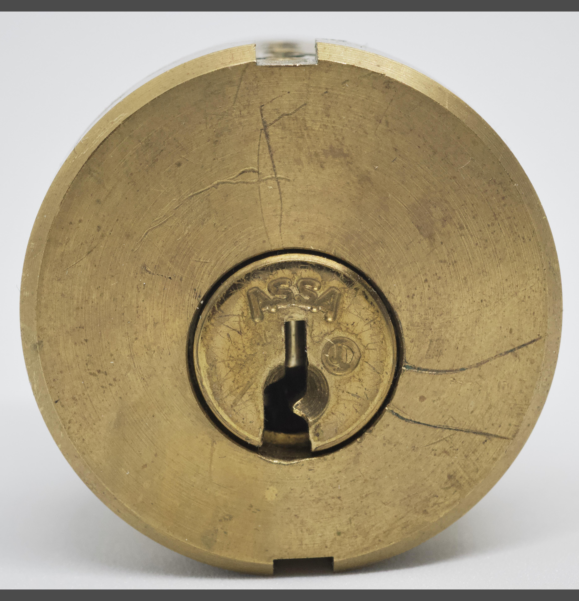
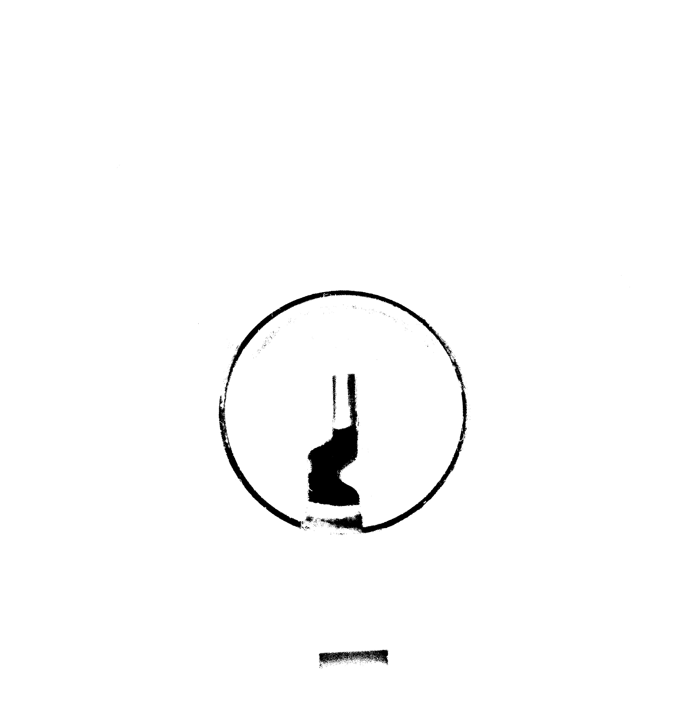
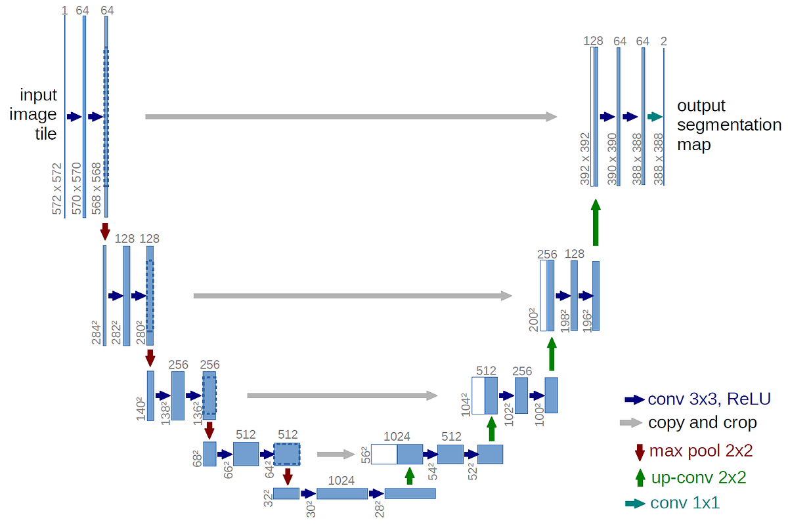

## Keyway/Lock Identifier

A small computer vision project to take an image of a lock and pick out the exact keyway model with convolutional neural networks and a shape matching database.

Work is in progress for turning it into a convenient mobile app.



### Motivation

Recently I have taken a keen interests in locks and lockpicking, its a fun albeit niche hobby of tactile puzzle solving. I tend to order old locks in bulk from ebay, however they often come without a key, and whether for convenience or as a refrence I often want to either cut a key to fit, or possibly even repin the lock to make it more challenging.

I often have the problem that, many of my padlocks are old and nontrivial to research, often featuring uncommon keyways that in some cases are many decades old, and specific to some long forgotten brand. For door locks where long term maintenance is more of an issue, there tends to be a few brands like Schlage, Kwikset, Best etc. that dominate the market and have fairly organized sets of keyways with some being much more common. But with padlocks especially older ones its often a crapshoot.

There are resources like the ILCO key catalogue that have 2d diagrams of the shape of each key/keyway pair known to man, and their specifications. However, it contains thousands of keyways with no straightforward way to search through them if there isn't an obvious manufacturer to search under. 

So I figured some simple computer vision should let me brute force my way to the answer!

### Development

Initially I thought this would be a very quick project. The keyway should be dark, just apply some simple computer vision techniques like thresholding and I would be off to the races...

Unfortunately lighting is not always so ideal and locks being metallic tend to be quite reflective. While adding some local scaling to the thresholding can mostly account for varied lighting, a recurring issue I was running into was the pins inside the lock would reflect back light and remove the top part of the keyway. (See below)

| Original | Thresholded |
| -------------------------- | ----------------------------------- |
|   |   |
|  |  | 

It was failing on what I would consider even fairly high quality images, and I really wanted this to be a robust tool that wouldn't be too finnicky and could handle many different lighting environments well. So I tried a few approaches based on contours and edges however they really only added more complexity and were still troublesome at best. I finally decided after a few weeks of tinkering that I was going to have to going to have to change my approach and so I resorted to image segmentation via neural networks.

What I ended up using was based on the resnet (residual network) architecture of networks, which have demonstrated high performance and accuracy at image segmentation. 



The actual segmentation network is fairly straightforward first using repeated convolutions to down sample and then up sample with some residual connections in between which help in speeding up training for such a deep network. I figured that even a very small scale version of this network should suffice as the pattern its trying to recognize is relatively simple in the world of image segmentation. The bulk of the time was spent manually photographing and labeling my collection as well as images from the internet as training data. To make this dataset more comprehensive I used ablumentations to rotate, crop, alter and transform the images to artificially increase the size of the limited training data.

I am very happy with how this project has turned out so far, the segmentations even for the more ambiguous images in the dataset are very accurate sometimes better than my original labels, which is very satisfying. I want to at some point turn this script into a convenient mobile app... at some point whenever I have the time to get around to it.

### Running

While the code is provided the dataset is unfortuantely too large to be uploaded directly to the github repository. Regardless the bulk of the code is in the jupyter notebook file, there are a few miscellaneous scripts for formatting the dataset. The checkpoints are included so if you want to take a look around just run...

```$ jupyter-notebook LockSegment.ipynb```

If you're interested in the training dataset or just want to ask about the project shoot me an email, or create a github issue.

### Resources

- [Ablumentations](https://github.com/albumentations-team/albumentations)
- [ImageSegmentation](https://github.com/qubvel/segmentation_models)
- [Tensorflow](https://www.tensorflow.org/api_docs)
- [ResNet](https://arxiv.org/abs/1512.03385)
